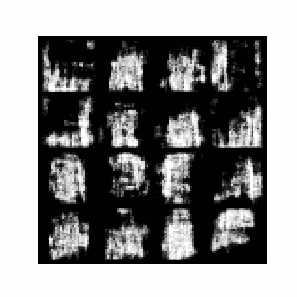
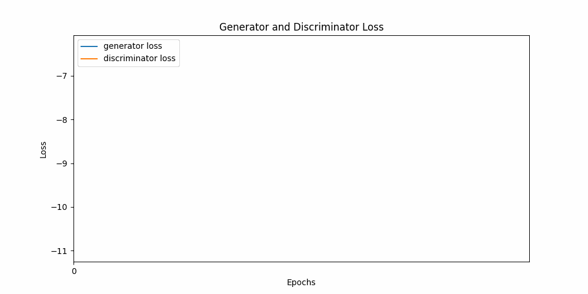

# WGAN‑GP on Fashion‑MNIST

An implementation of **Wasserstein GAN with Gradient Penalty (WGAN‑GP)** trained on the Fashion‑MNIST dataset.  
Includes training, visualization, and evaluation with FID.

---

## 📌 About

A modular framework featuring:

- Training with **WGAN‑GP loss** for stable convergence  
- **InstanceNorm** in Generator/Discriminator  
- Visual outputs:  
  - Generated image grids per epoch  
  - Loss curve plots  
  - GIFs to track training progress  
- **FID evaluation** for quantifying image quality

---

## 📂 Project Structure

```
├── data_preprocessing.py   → Load & preprocess Fashion‑MNIST  
├── model.py                → Generator & Discriminator definition  
├── train.py                → WGAN‑GP training loop  
├── evaluation.py           → FID computation  
├── visualization.py        → Image/gif utility functions  
├── main.py                 → Run training & evaluation  
├── results/                → Generated images, loss plots, GIFs  
└── README.md               → Project documentation
```

---

## 🚀 Usage

1. Clone the repository:
   ```bash
   git clone https://github.com/abolfazl-79/WGAN-GP-FashionMNIST.git
   cd WGAN-GP-FashionMNIST
   ```

2. Install dependencies:
   ```bash
   pip install torch torchvision matplotlib imageio numpy scipy
   ```

3. Run the training script:
   ```bash
   python main.py
   ```

---

## 📊 Results

### Generated Samples Through Training  


### Loss Curve Evolution  


---

## 📈 Evaluation

After training, FID is computed using the `evaluation.py` module. Lower values indicate better quality.  
```
Fréchet Inception Distance is: <Your FID Value>
```

---

## ⚙️ Requirements

- Python 3.8+  
- PyTorch  
- torchvision  
- matplotlib  
- imageio  
- numpy  
- scipy  

---

## 📜 License

This project is shared under the **MIT License**. Feel free to view, modify, and build upon it.
